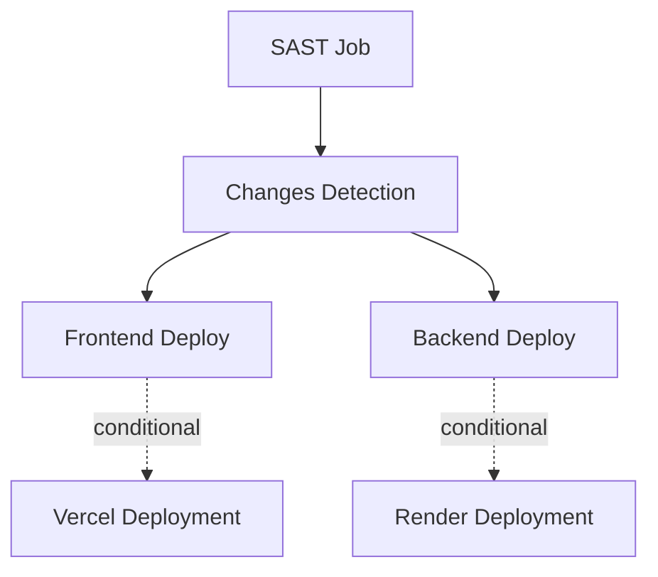

# Deploy Workflow Guide

## Overview

The `deploy.yml` workflow is a comprehensive GitHub Actions pipeline that handles static application security testing (SAST) and automated deployment for both frontend and backend components of the smart-tasks application. Located at `.github/workflows/deploy.yml`, this workflow implements a security-first approach with conditional deployment based on code changes.

## Workflow Structure

### Triggers
The workflow is triggered on:
- **Push to master branch** (`push: branches: [master]`)
- **Pull requests** (`pull_request:`)  
- **Manual dispatch** (`workflow_dispatch:`)

### Jobs Architecture

The workflow consists of 4 main jobs that run in sequence:

## Job Breakdown

### 1. SAST Job (`sast`)

**Purpose**: Static Application Security Testing using multiple security tools

**Location**: Lines 11-56 in `.github/workflows/deploy.yml:11-56`

**Components**:

#### CodeQL Analysis
- **Language Support**: JavaScript and TypeScript
- **Query Set**: `security-and-quality` (comprehensive security and code quality rules)
- **Category**: `monorepo-js` (optimized for monorepo JavaScript projects)
- **Process**:
  1. Initialize CodeQL with security queries
  2. Auto-build the project to understand code structure
  3. Analyze codebase for security vulnerabilities and code quality issues

#### Semgrep CLI Analysis  
- **Rulesets Used**:
  - `p/ci` - General CI/CD security rules
  - `p/javascript` - JavaScript-specific security patterns
- **Output Format**: SARIF (Static Analysis Results Interchange Format)
- **Error Handling**: `|| true` ensures workflow continues even if Semgrep finds issues
- **Integration**: Results uploaded to GitHub Code Scanning for review

**Permissions Required**:
- `contents: read` - Access repository code
- `security-events: write` - Upload SARIF results to Code Scanning
- `actions: read` - Access workflow metadata

### 2. Changes Detection (`changes`)

**Purpose**: Determine which parts of the monorepo have changed to enable conditional deployment

**Location**: Lines 58-74 in `.github/workflows/deploy.yml:58-74`

**Dependencies**: Requires `sast` job completion (`needs: sast`)

**Logic**:
- Uses `dorny/paths-filter@v3` action to detect file changes
- **Client Detection**: Monitors `client/**` directory for frontend changes
- **Server Detection**: Monitors `server/**` directory for backend changes

**Outputs**:
- `client`: Boolean indicating if frontend code changed
- `server`: Boolean indicating if backend code changed

### 3. Frontend Deployment (`frontend`)

**Purpose**: Deploy React/frontend application to Vercel

**Location**: Lines 76-121 in `.github/workflows/deploy.yml:76-121`

**Conditional Execution**: Only runs if `needs.changes.outputs.client == 'true'`

**Environment**: 
- **Target**: `production` environment
- **Concurrency**: `vercel-frontend-prod` group with `cancel-in-progress: true`

**Process**:
1. **Setup Phase**:
   - Checkout code
   - Setup Node.js 20 with npm caching
   - Cache based on `client/package-lock.json`

2. **Build Phase**:
   - Install dependencies: `npm ci` in client directory
   - Build application: `npm run build` in client directory
   - Validates build before deployment

3. **Deployment Phase**:
   - Install latest Vercel CLI globally
   - Pull production environment configuration
   - Build for production with Vercel
   - Deploy prebuilt application to production

**Required Secrets**:
- `VERCEL_TOKEN`: Authentication token for Vercel API
- `VERCEL_ORG_ID`: Organization/team identifier
- `VERCEL_PROJECT_ID`: Specific project identifier (format: `prj_...`)

**Vercel CLI Commands Explained**:
- `vercel pull`: Downloads project configuration from Vercel
- `vercel build --prod`: Builds the application for production
- `vercel deploy --prebuilt --prod`: Deploys the pre-built application

### 4. Backend Deployment (`backend`)

**Purpose**: Deploy Node.js/backend application to Render

**Location**: Lines 123-139 in `.github/workflows/deploy.yml:123-139`

**Conditional Execution**: Only runs if `needs.changes.outputs.server == 'true'`

**Environment**:
- **Target**: `production` environment  
- **Concurrency**: `render-backend-prod` group with `cancel-in-progress: true`

**Process**:
1. Checkout code
2. Trigger Render deployment via REST API call
3. Uses POST request to Render's deploy endpoint

**Required Secrets**:
- `RENDER_API_KEY`: Authentication bearer token for Render API
- `RENDER_SERVICE_ID`: Specific service identifier on Render

**API Call Details**:
- **Method**: POST
- **URL**: `https://api.render.com/v1/services/{SERVICE_ID}/deploys`
- **Headers**: 
  - `Authorization: Bearer {API_KEY}`
  - `Accept: application/json`
- **Flags**: `-fsS` (fail silently on server errors, show progress)

## Security Features

### 1. Multi-Layer Security Scanning
- **CodeQL**: Advanced semantic analysis for security vulnerabilities
- **Semgrep**: Pattern-based security rule matching
- **Integration**: Both tools upload results to GitHub Code Scanning

### 2. Environment Protection
- Uses GitHub Environment protection rules for `production`
- Secrets are properly scoped and encrypted
- Concurrent deployments are managed to prevent conflicts

### 3. Dependency Management
- npm cache optimization reduces build time and improves security
- Dependency installation uses `npm ci` for reproducible builds
- Node.js version pinned to 20 for consistency

## Workflow Benefits

### 1. Security-First Approach
- All deployments must pass SAST checks
- Multiple security tools provide comprehensive coverage
- Security findings integrated into GitHub's native security tab

### 2. Efficient Resource Usage
- **Conditional Deployment**: Only affected services are deployed
- **Concurrency Control**: Prevents resource conflicts
- **Caching**: npm dependencies cached for faster builds

### 3. Monorepo Support
- Intelligent change detection for frontend/backend
- Independent deployment pipelines for each service
- Optimized for monorepo architecture

### 4. Production-Ready
- Environment-specific configurations
- Proper error handling and rollback capabilities
- Integration with professional deployment platforms (Vercel, Render)

## Configuration Requirements

### GitHub Secrets
Set these in repository settings under Secrets and Variables > Actions:

**Vercel Secrets**:
- `VERCEL_TOKEN` - Generated from Vercel account settings
- `VERCEL_ORG_ID` - Found in Vercel team/org settings  
- `VERCEL_PROJECT_ID` - Available in project settings (starts with `prj_`)

**Render Secrets**:
- `RENDER_API_KEY` - Generated from Render account API keys section
- `RENDER_SERVICE_ID` - Found in service URL or settings

### GitHub Environment
Create a `production` environment in repository settings to enable:
- Deployment protection rules
- Environment-specific secrets
- Deployment history tracking

## Troubleshooting

### Common Issues

1. **SAST Failures**: 
   - Check Code Scanning tab for security findings
   - Review Semgrep and CodeQL results
   - Fix security issues before deployment proceeds

2. **Deployment Skipped**:
   - Verify changes were made to correct directory (`client/` or `server/`)
   - Check paths-filter configuration in changes job

3. **Vercel Deployment Issues**:
   - Verify all three Vercel secrets are correctly set
   - Check Vercel project configuration and permissions
   - Review build logs for dependency or build failures

4. **Render Deployment Issues**:
   - Verify API key has proper permissions
   - Check service ID matches the target service
   - Review Render service logs for deployment status

### Monitoring
- **GitHub Actions**: Check workflow run details and logs
- **Code Scanning**: Review security findings in repository Security tab
- **Vercel Dashboard**: Monitor frontend deployment status and performance
- **Render Dashboard**: Track backend service health and deployment history

This workflow represents a production-grade CI/CD pipeline that prioritizes security while maintaining efficient deployment processes for a modern web application stack.